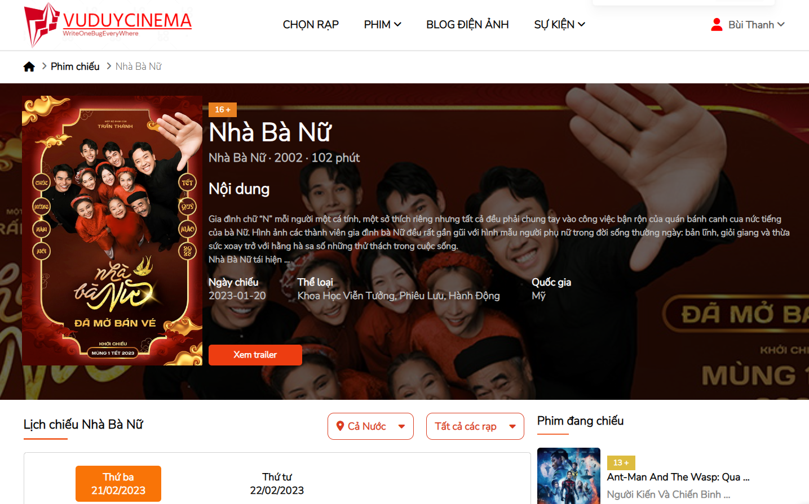
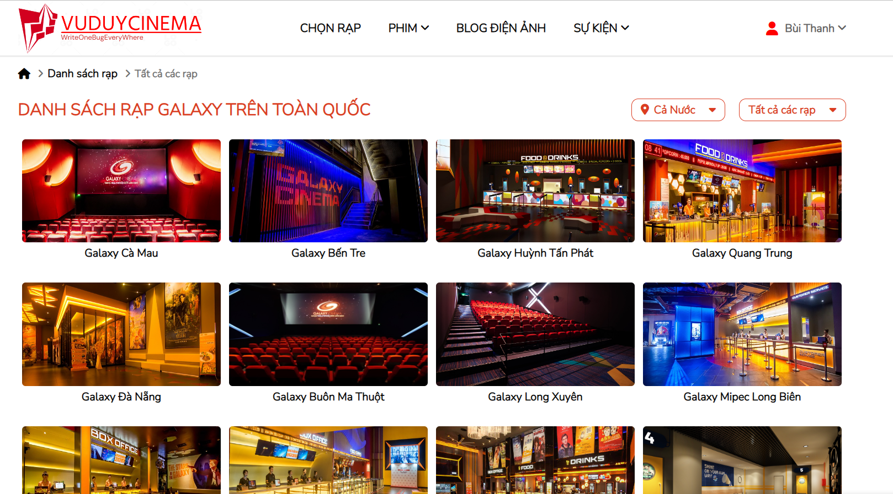

# CINEMA BOOKING PROJECT

## Introduction

My project was built by ReactJs and aimed to allow users book cinema ticket. There are 2 two flows of booking:

- The first one is to let users select movie first and select cinema afterward
- The other one is opposite: the users choose cinema first and then select movie.

## Features

There are few things you can do with the App:

- Booking cinema ticket throughout 2 flows
- Having access to Blog Film
- Getting booked tickects
  
  
